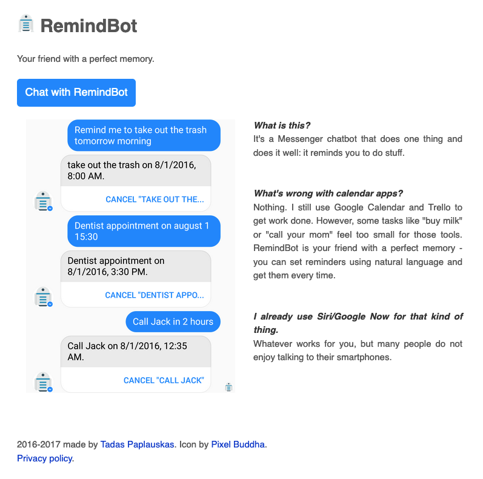

# RemindBot
[remindbox.xyz](https://remindbot.xyz) - your friend with a perfect memory.

### What is this?
It's a Messenger chatbot that does one thing and does it well: it reminds you to do stuff.

### What's wrong with calendar apps?
Nothing. I still use Google Calendar and Trello to get work done. However, some tasks like "buy milk" or "call your mom" feel too small for those tools. RemindBot is your friend with a perfect memory - you can set reminders using natural language and get them every time.

### I already use Siri/Google Now for that kind of thing.
Whatever works for you, but many people do not enjoy talking to their smartphones.

Licensed under GNU General Public License v3.0.
